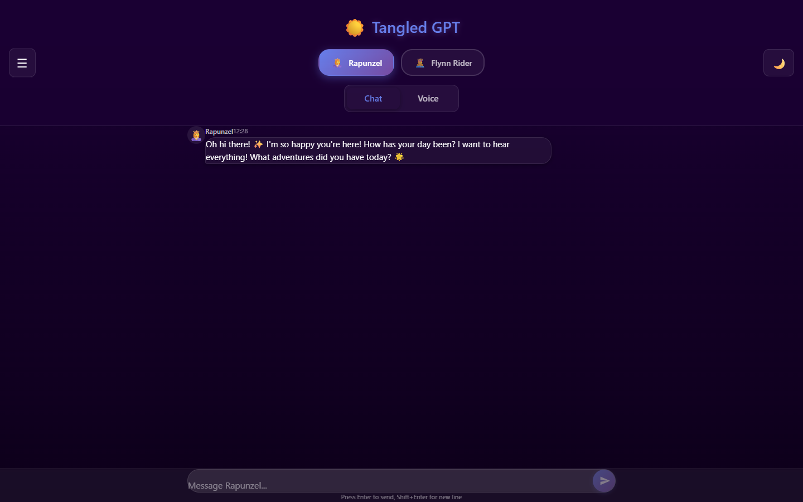

# 💜 Tangled-GPT

> *"I've got a dream..."* - An AI chat interface with Disney-inspired personality modes

A mobile-first ChatGPT-like interface featuring custom personality modes inspired by Disney's Tangled. Switch between Rapunzel and Flynn Rider personalities for a unique conversational experience.


## 🔗 Live Site

- Local: [http://localhost:3000](http://localhost:3000)
- Repository: [https://github.com/rohankrishnaullas/tangled-gpt-public](https://github.com/rohankrishnaullas/tangled-gpt-public)

## 🖼️ Screenshot



## 🌟 Features

### Core Features
- **ChatGPT-like Interface** - Clean, mobile-optimized chat experience
- **Personality Modes** - Switch between Disney-inspired personalities:
  - 👸 **Rapunzel** - The curious, dreamy Disney princess
  - 🤴 **Flynn Rider** - The charming, witty adventurer
- **Mid-Conversation Switching** - Change personalities without losing chat history
- **Dark/Light Mode** - Comfortable viewing in any lighting
- **Chat History** - Persistent conversations with timestamps

### Technical Features
- Mobile-responsive design (works on all screen sizes)
- Azure OpenAI integration with streaming responses
- Local storage persistence
- Simple authentication

## 🎯 Purpose

A demonstration of personality-driven AI chat interfaces, showing how LLMs can adopt different character traits and communication styles. Perfect for exploring how system prompts can shape conversational AI behavior.

## 🏗️ Tech Stack

| Layer | Technology |
|-------|------------|
| Frontend | React 18, CSS Modules |
| Backend | Azure OpenAI (GPT-4o) |
| Hosting | Azure Static Web Apps |
| State | React Context + LocalStorage |
| CI/CD | GitHub Actions |

## 🚀 Quick Start

### Prerequisites
- Node.js 18+
- npm or yarn
- Azure subscription with OpenAI access

### Installation

```bash
# Clone the repository
git clone https://github.com/YOUR_USERNAME/tangled-gpt.git

# Navigate to project
cd tangled-gpt

# Install dependencies
npm install

# Set up environment variables
cp .env.example .env
# Edit .env with your Azure OpenAI credentials

# Start development server
npm start
```

### Environment Variables

```env
REACT_APP_AZURE_OPENAI_ENDPOINT=your-endpoint
REACT_APP_AZURE_OPENAI_KEY=your-key
REACT_APP_AZURE_OPENAI_DEPLOYMENT=your-deployment-name
REACT_APP_AUTH_USERNAME=your-username
REACT_APP_AUTH_PASSWORD=your-password
```

## 🎭 Personality Modes

### Rapunzel Mode 👸
Channel the curious princess from Tangled:
- Optimistic and dreamy
- Curious about everything
- Supportive and encouraging
- Uses phrases like "I've got a dream..."
- Gentle and caring

### Flynn Rider Mode 🤴
The charming rogue with a heart of gold:
- Witty one-liners and banter
- Playfully sarcastic
- Confident but kind
- Uses his signature smolder 😏
- Protective and supportive underneath the charm

## 📖 Documentation

- [Architecture Guide](./ARCHITECTURE.md)
- [Deployment Guide](./DEPLOYMENT_GUIDE.md)
- [Personality Configuration](./PERSONALITY_CONFIG.md)

## 🔒 Privacy

- Simple username/password authentication
- No data leaves the device except to Azure OpenAI
- Chat history stored locally in browser
- No analytics or tracking

## 🛠️ Development

### Project Structure
```
tangled-gpt/
├── public/
│   └── index.html
├── src/
│   ├── components/      # React components
│   ├── services/        # API services
│   ├── context/         # React contexts
│   ├── styles/          # CSS modules
│   ├── data/            # Personality data
│   │   └── personalities/
│   ├── utils/           # Helper functions
│   └── App.js
├── .env.example
├── package.json
└── README.md
```

### Commands

```bash
npm start       # Start dev server
npm build       # Build for production
npm test        # Run tests
```

## 🤝 Contributing

Contributions are welcome! Feel free to submit issues or pull requests.

## 📄 License

MIT License - Feel free to use this project for learning and development.

## 💜 Acknowledgments

- Inspired by Disney's Tangled
- Built with React and Azure OpenAI
- Designed for mobile-first experiences

---

*"All at once everything looks different..."* 💜
